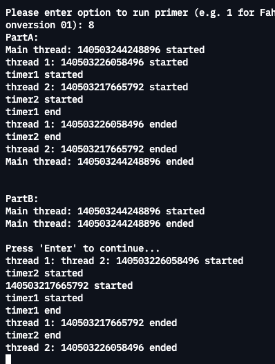

# Primer Portfolio

## Section 1 - Primer Challenges
### Primer 1 - Fahrenheit / Centigrade Conversion
This challenge requires us to allow a user to enter a value before selecting whether to convert it from:

Fahrenheit to Centigrade
Centigrade to Fahrenheit
Kelvin to Centigrade
Centigrade to Kelvin
Fahrenheit to Kelvin
Kelvin to Fahrenheit

As part of the initial design six functions that implement the formulas of each conversion were needed.
 

To help complete this challenge I needed to break the overall problem down into the following main tasks: 
* Get data from the user
* Verify the data is in a suitable format
* Create a method to convert F->C represented by 'C'
* Create a method to convert C->F represented by 'F'
* Create a method to convert C->K represented by 'K'
* Create a method to convert K->C represented by 'G'
* Create a method to convert F->K represented by 'D'
* Create a method to convert K->F represented by 'H'
* Display conversion

 
#### Reflection (as well as issues, challenges & resolutions)
To solve the primer I started by getting the input and testing it, then displaying the options and testing it, then writing the fucntions to perform the conversions for C->F and F->C and testing it, followed by displaying the resulted conversion. Finally, I added the 'Additional revisions' requirements to the code(i.e Kelvin, etc).

Once I had a working version that met the overall requirements I went into working on validation, such as making sure the user entered a valid temperature value (isNumber()) or a valid conversion choice (readChar()). My next step was improving readability, an example of that was creating a variable called 'msg' that will hold the message to be display to the user. 

One particular case where I couldn't use the message variable was when printing the result, because in order to create the message I used 'std::to_string' to covert the temperature values to string - in order to concatenate them to the final message - and 'std::to_string' by default has the precision of 6 decimals so instead of printing '60.1' it was printing:

I then played with  'std::cout.precision(3)' but this approach will also affect the converted temperature to have only two decimals (in that case I needed all the decimals):

The other solutions was to explicitly define the precision to each temperature value (original and converted) making the message a longer line than just writing directly to 'std::cout'. I decided to not create a message and leave it as:

Another challenge was implementing the helper function isNumber() as I used regex to do the validation.I have used regex in the past with SQL (working as a Data officer) and also during Ada's Lunchpad but not on a regular basis, so getting the pattern right still takes me good time of trial and error.

The other challenge was to spot parts of the code that can be taken out and become a function on their own in order to improve usability, readability and design. Examples of that were the userInput() and readFloat(). Creating those those functions made fahrenheitCentigradeConversion() shorter and easy to read and I was able to reuse some of those functions in other primers such as primer2.

### Primer 2 - Self-service Checkout
This challenge requires us to create a selfservice checkout program where the user inputs the quantity of a specific item and its cost (this can be done 0 or many times). The result is the calculation of the total purchase including tax.

As part of the initial design two functions that implemented the accumulative calculation of the cost of the items and the calculation of the tax were needed.

To help complete this challenge I needed to break the overall problem down into the following main tasks: 
* Get data from the user
* Verify the data is in a suitable format
* Create the methods to implement the basic calculations (subtotal and tax)
* Display the purchase details (subtotal, tax and total)

#### Reflection (as well as issues, challenges & resolutions)
To solve the primer I started by getting the input of the item's quantyties and testing it, followed by getting the input of the cost of the item and testing it. then I worked on creating the brances to check the conditions (0 to finish the purchases, else to keep purchasing) and test it. Lastly, I implemented the calculation of the subtotal, tax and total and their display.

After the primer met the overall requirements then I moved to add the 'Additional revisions' requirements to the code (rounding to two decimal places). 

This primer brought a similar challenge that I faced on primer1, I used 'std::cout.precision()' but the result didn't always result in two decimal places. So I implemented a helper function called roundTwoDecimal() which only two decimals if the original value has more than two decimals.

As I had already implemented userInput() I was able to reuse that function to get the input for the user with few lines of code. I was also able to reuse readFloat() making easy the input validation.

### Primer 3 - passwordComplexityChecker
This challenge requires us to check the complexity of a password entered by the user when prompted. 

As part of the initial design two functions were needed: one that implements the counts of numbers, chars and special chars; the second function implements the calculation of a value to determine the complexity of the password (1, 2, 3, 4).

To help complete this challenge I needed to break the overall problem down into the following main tasks: 
* Get data from the user
* Verify the data is in a suitable format
* Create the method to implement the counts (numbers, chars and special chars)
* Create a method to calculate the complexity value of the password (1, 2, 3, 4)
* Display the result

#### Reflection (as well as issues, challenges & resolutions)
To solve the primer I started by getting the user's input and testing it. I decided to add code to display a text before asking the user input to guide the user in the creation of a strong password. Then I implemented the functions to calculate the counts using regex ('getMatchCount')and test it. After that, I implemented the code to calculate the complexity value ('getValuePassword') and test it. lastly, I put all together and displayed the result.

This time using regex was straightforward as I had already practiced using them when creating the helper functions for primer1 and primer2. When implementing 'getValuePassword' function I used if statements, the first value I assigned was 1, then I wanted to implement the value for 2 but I realised than in order to get that one done properly I needed to implement values 3 and 4 first, so I did that and I implemented value 2 last.

I was also able to use the userInput() function and I created an extra helper function called readString() following similar logic than readInteger() and readFloat(). The idea of these 'readXXX' functions are to implement a do/while loop so the program can validate the input and will continue only if is correct, because of this I didn't include in the 'switch' statement a 'default case' where the input was invalid.

I also, improve the display of text by creating a variable 'msg' that held the common part of the final display, making the 'switch' statement shorter and in the case the text needs to be edited it will need to be changed only once.

In primer3 I decided to use variables of type 'unsigned short int' as in the lecture was mentioned that it requires less memory than a type 'int' and as my variables were tighted to the lenght of the password which is not going to be as long as the max value that an 'int' can hold, I thought here was a good place to use 'unsigned short int'.

### Primer 4 - employeeListRemoval
This challenge requires us to store employees' names in a container, display the contents of the container, ask the user for a name that she/he wishes to delete from the container and delete it from it if exists in the container. 

As part of the initial design one function was needed: a function the implements the search of the name of an employee in the container and returns the index of the name if it matches the one entered by the user.

To help complete this challenge I needed to break the overall problem down into the following main tasks: 
* Create container
* Store data
* Get data from the user
* Verify the data is in a suitable format
* Create the method to implement the search of the name
* Delete a name if there is a match
* Display the result

#### Reflection (as well as issues, challenges & resolutions)
To solve the primer I started by deciding which container to use to store the names. Even though the requirements for the primer suggested to use array, I found using vector more flexible, mainly because the size is not fixed like in the array's case. Then I appended the values to the vector and test it. Then I worked on displaying the list of employees and get input from the user and test it. Lastly, I implemented a physical delete of the name from the vector. Doing a logical deletion as it is usually the case when working with databases would have included and extra value per line in the csv to represent wheter it was deleted or not, like 0(not deleted) or 1(deleted). The way I would have try to manage that data maybe would have been creating a structure to hold both values (name and deletion) per employee (or csv line) and create a container that stores that type of structure. The advantage of the structure is that allows to use '.' to access the attributes of each employee.

One of the biggest challenges I had was to make the matching case insentive which is part of the function 'findEmpName'. I originally had used 'std::find' but this solution was not robust enough as it was case sensitive. Researching online I found that I a way to solve it is using 'std::find_if' and using lambdas https://stackoverflow.com/a/36494902. So I did more research in order to understand the structure of the lambda function and why it was using '[]', I am familiar with pointers as I have some experience with C, but '[]' was new to me. 

[&] is the capture clause for lambda expressions, since '&' is not accompanied by a specific variable it means that the lambda will get all the variables by their reference, It could have been used the value instead of the reference with [=] instead of [&]. Once I understood the solution then I felt comfortable using it.

'By reference' only takes the address, in this particular case is the address of the beginning of a 'string' so it takes less memory than passing the value. Strings are an array of 'char' and the way the computer knows the collection is a 'string' is because after the last char it adds '\00000000' this is invisible to the user but all strings are in fact 1 space longer than the actual text and because of this the computer can figure out when the string finishes. (I learnt this when I took the CS50 MOOC class in March 2020, this is the link for the same content for 2021 https://cs50.harvard.edu/x/2021/notes/4/#strings).

The refactoring process also included to take the code to delete the name form the list and make a function to implement it, which I called 'deleteEmployee'. This function also get the vector 'By reference' in order to access the vector and manipulate it, without the '&' the function will implement the actions on a copy of the vector not the actual vector. This is not the case of arrays, when we pass them to a function as a parameter by default it passes the pointer of the array.

In this primer I was able to reuse the 'getMatchCount' function which I originally created for primer3.

### Primer 5 - phoneDirectory
This challenge requires us to read a file (external data stream) and get user input (either name or phone, not both)to match their request with the information in the file, if there is a macth return the information in a specific format.

As part of the design I created the following functions:
* readPhoneBook
* stringToLower
* countLine
* storeMatchInput

To help complete this challenge I needed to break the overall problem down into the following main tasks: 
* Create container
* Access file
* Get data from the user
* Verify the data is in a suitable format (either letters for the name or numbers for the phone but not both type of characters).
* Read file and match 
* Display the result

#### Reflection (as well as issues, challenges & resolutions)
The biggest challenge I had when implementing the primer was making it case insentive, when I made the line lower case then the final display will show the information in lower case. So I created a 'lowerLine' string variable to store a copy of 'line' and do the matching using the lowercase version but using the original 'line' to store the matched line into the vector. However, I kept faling at creating the copy. After a lot of research I realised the solution was very simple, I had forgotten to write: 'lowerLine = line;'. That was silly but I was very pleased I could moved on.

Another thing to take into account is that my code reads the file twice, and for that is important to clear the stream status and reset the position to the begining of the file, so when we want to read the file again from the beginning is ready to do so. This was an issue when doing the primer6 (my original solution only read the file once), so I used it here when I was refactoring and decided to do the count of lines in a different step.

My validation doesn't take into account the spaces, so if the phone number for example is entered by the user without spaces it won't match, to solve this I would use regex.

### Primer 6 - dataFileParser
This challenge requires us to read a file (external data stream), the process and display the data in a specific format.

To help complete this challenge I needed to break the overall problem down into the following main tasks: 
* Access file
* Calculate max lenght of 2nd and 3rd column
* Display headers
* Display '-' 
* Display records

#### Reflection (as well as issues, challenges & resolutions)
Formatting was a big challenge but once I discovered the library 'iomanip', the process was much easier and fun. I enjoyed playing with 'setfil', 'left' and 'setw'. The way I separated the columns was using tab '\t' but this needs to be revisited as it is not felxible enough.

As I mentioned before, If one needs to read the file more than once it is important to clear the stream flags that tells the program that it has reached the end of the file and we reposition to the beginning of the file in order to be ready to read again. As I din't know that, my code originally printed the last line of the file in an infinite loop and in other trial and error didn't display information at all.

### Primer 7 - sleepTimer
This challenge requires us to create a function that blocks further execution based on time.

#### Reflection (as well as issues, challenges & resolutions)
To help complete this challenge I reviewed the lecture and the slides presented by the teacher. for this it was used 'this_thread::sleep_for' to allow us to access a single thread of execution and block it for a specified time.

Using time was a concrete way to see the behavior of the processes which made it easier for me to understand threads.

### Primer 8 - joinDetachThreads
This challenge was divided in two parts. First part was to create threads and join them, and the sceond part was to create threads and detach them. 

The design included the following functions:
* timer1 and timer2
* threadFunction1 and threadFunction2
* joinFunction (Part A)
* detachFunction(Part B)

To help complete this challenge I needed to break the overall problem down into the following main tasks: 
* Create the timers
* Create threads
* Create method to solve part A - joining
* Create method to solve part B - detaching

#### Reflection (as well as issues, challenges & resolutions)
To solve this challenge I wanted to reuse the primer7 but as to follow the requirements I decided to create specific timers (1 and 2) instead. BUt it was basically the same code that primer7. Then from the lecture slides I created the 'threadFunctionsX' to create thread1 and thread2. Once I had the elements I needed to play with the threads I created the two functions one to join and one to detach.

As expected the 'join' part of the primer waited for the threads to finish before ending joinDetachThreads(), whereas the 'detach' had an unreliable behavior.

The below three screenshots, show how part A (joining) consistently displays the same result, in the same order and the last line is 'Main thread' which means that threads 1 and 2 finished and after that joinDetachThreads() ended.

On the other hand the image above shows 'Main thread' ended before 'timer1' ended for example.

The behavior of the 'detach' part is inconsistent and unreliable because each thread gets detached from the function that called them (joinDetachThreads()) and go in separate ways. 

In the image above we can see that this time the 'detach' behavior meant that 'Main thread' ended right after 'Main thread' started. 

In the image above not only 'Main thread' ended right after 'Main thread' started, but 'thread1' didn't print its 'id' instead immediately printed 'thread2'. Also 'timer1' started after 'timer2'. 

### Primer 9 - carClass
This challenge was to create a class for the object Car with private attributes and eigth public methods.

The design included the following:
* CarClass
* Menu

To help complete this challenge I needed to break the overall problem down into the following main tasks: 
* Create Car class with its attributes, constructor, setters, getters and other related methods
* Create Menu
* Get data from the user

#### Reflection (as well as issues, challenges & resolutions)
Creating this primer was similar than when working with Java, at work we implemented three versions of a bank application using Java. However, when I reviewed the requierements I made some changes to the class (i.e allowed user to instantiate the object with all four values) which lead me to use 'this' (because I was using the same name of the member attributes in the setters parameters) but when I tried to reach the attribute using '.' like in Java, it gave me an error, so I tried '->' (to access properties in a structure pointed to by a pointer https://cs50.harvard.edu/x/2021/notes/5/#data-structures) and that allowed me to access the class' attribute.

In this primer I reused primer7, so I added 'sleepTimer()' for two seconds to give some time for the user to read the output.

### Primer 10 - areaOf
I was not sure what was asked in the primer, so my first attempt solved the problem but not in the most flexible way. After redaing the task several times I realised that the intention here is to use inheritance, so I created a new solution from scratch.

This new solution includes:
* Abstract class Shape (Interface)
* Circle class
* Square class
* Rectangle class
* Triangle class
* Trapezoid class

To help complete this challenge I needed to break the overall problem down into the following main tasks: 
* create the abstract class with the size() metho as a pure virtual functioon (not implemented/empty)
* create the classes that inherit from the abstract class 'Shape'
* create objects and instantiate them to display area of five shapes.

#### Reflection (as well as issues, challenges & resolutions)
Although, I lerant and practice a lot from implementing two solutions, the main reflection here is start coding when you are sure you understand what is been asked. One of my favorite parts of coding uisng OOP is overloading the constructors. It is also cool, to just get/set the methods/properties of an object using a '.' for example myTriangle.setBase() or myTriangle.getBase().

---
## Section 2 - Programming Paradigms
### Programming Paradigms
Simply put, a programming paradigm, for example, procedural, object-oriented, functional, structured, declarative, imperative and event driven can be described as a specific approach used when trying to solve a problem.  Although many programming languages can (and do) support multiple paradigms this discussion will focus more specifically on the possible benefits with examples of the potential differences and similarities of five from the above list. These are ...

---
## Section 3 - Continued Professional Development
### Benefits of becoming a Polyglot Programmer
Vestibulum vitae semper sem. Duis leo leo, suscipit at felis non, pellentesque varius massa. Sed sit amet orci nibh. Morbi scelerisque faucibus elit, vitae mollis turpis finibus eget. In convallis euismod nunc non imperdiet. Duis ultricies pulvinar lorem, sed molestie nunc porta at. Aenean arcu ante, efficitur nec felis sed, feugiat iaculis turpis. Vestibulum eu elementum diam. Quisque nec tortor auctor, scelerisque ante vitae, fringilla tellus.

Quisque ligula lectus, efficitur quis malesuada sit amet, malesuada sed nibh. In lorem erat, elementum quis tempus nec, rhoncus ac ante. Mauris suscipit massa tempor, pulvinar neque vel, gravida nulla. Donec massa diam, molestie in diam nec, vulputate faucibus ligula. Aliquam erat volutpat. Aliquam sit amet dui ligula. Nullam euismod eros ultrices magna convallis lobortis. Proin convallis placerat tincidunt. Quisque interdum, nisi id egestas luctus, augue libero lacinia urna, sit amet tempus nisl sem nec quam. Vestibulum interdum urna mauris, vel dignissim nisi dignissim egestas. Donec volutpat dictum dui, at egestas sem tristique nec.
